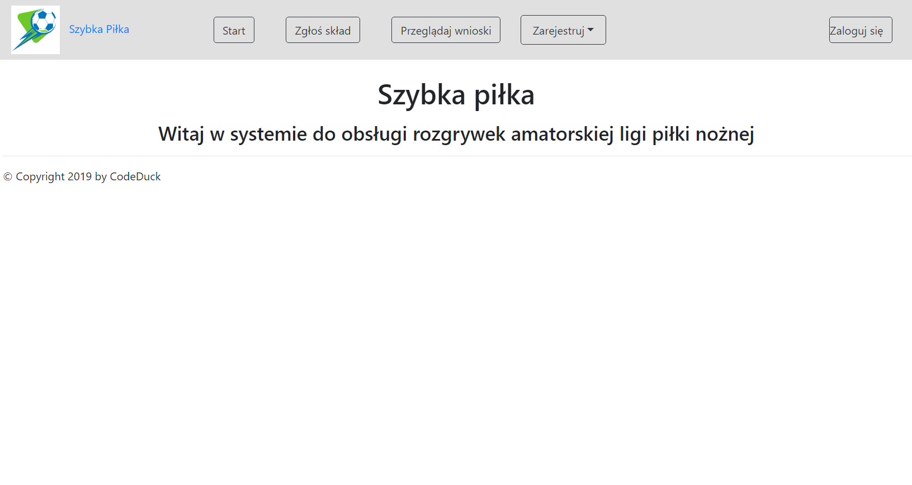
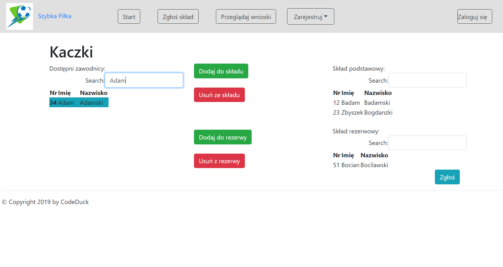
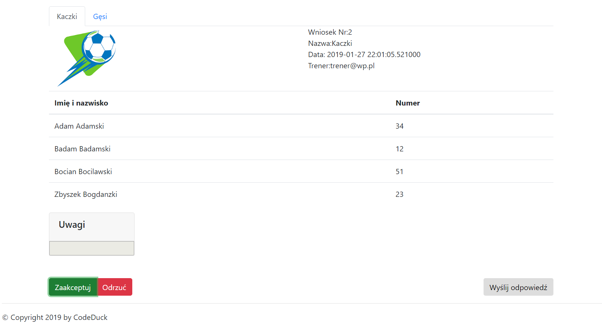

# Szybka Piłka

## Dane testowe

 * trener: `trener@wp.pl`, hasło `pokpok`
 * zarządca: `admin@wp.pl`, hasło `pokpok`
 * sędzia: `referee@wp.pl`, hasło `pokpok`


## Pylint

```
No config file found, using default configuration
************* Module app
C: 14, 0: Constant name "app" doesn't conform to UPPER_CASE naming style (invalid-name)

-----------------------------------
Your code has been rated at 9.94/10
```

## Zrzuty ekranu

### Strona główna



### Zgłaszanie składu



### Przyjmowanie wniosków


